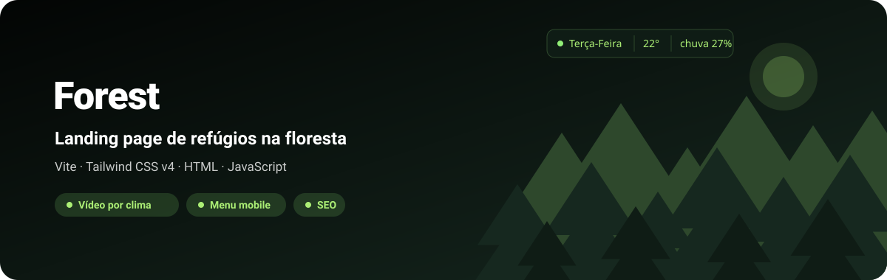
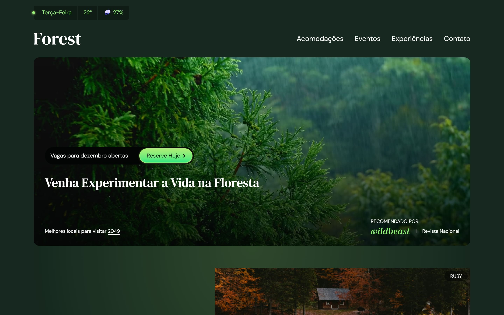
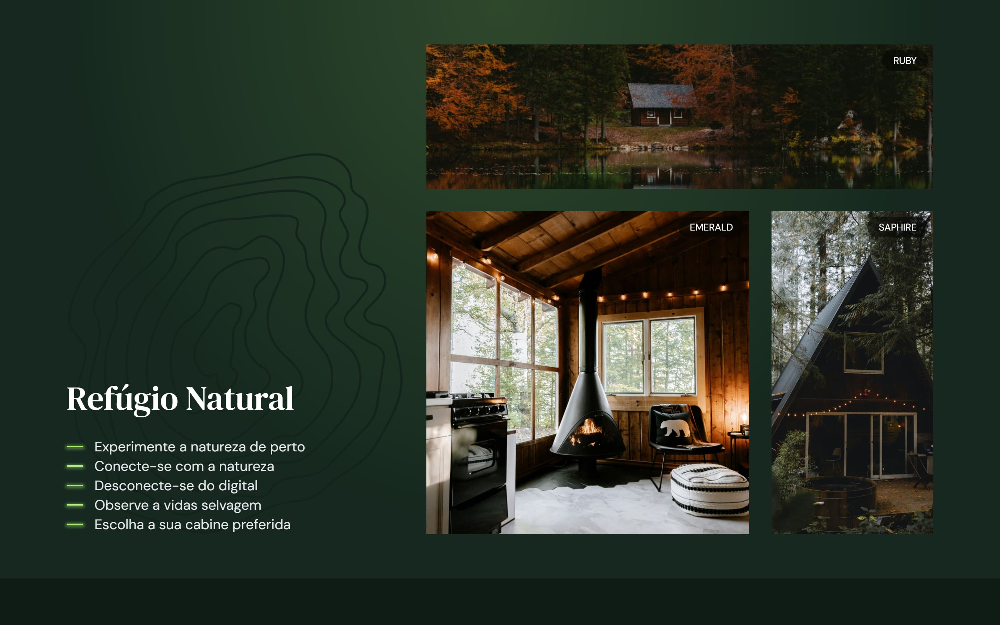
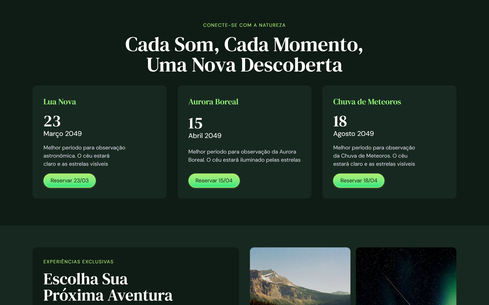
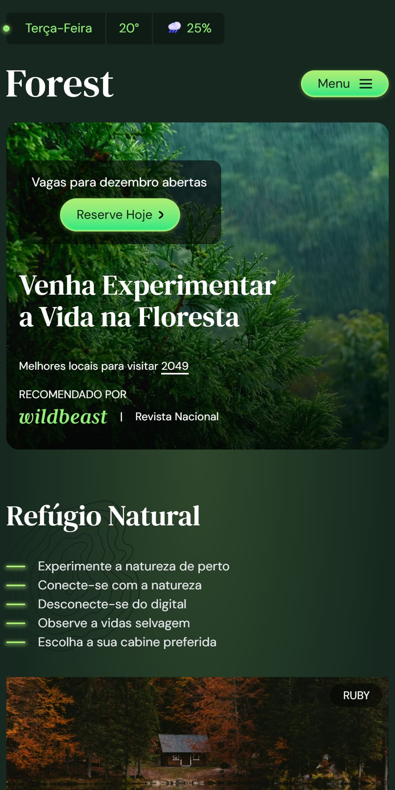
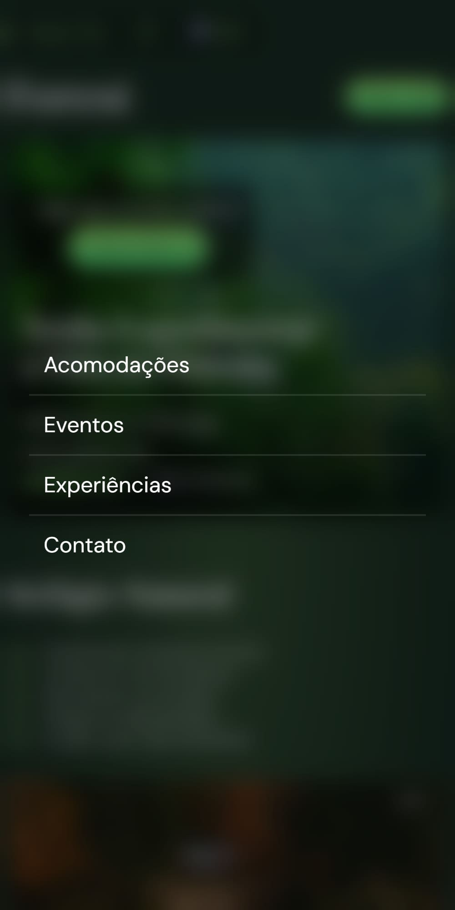

<div align="center">



**Landing page para aluguel de casas e chalés na floresta, com vídeo de fundo que muda conforme o "clima" do dia. Vite + Tailwind CSS v4.**

[](https://forest-web-six.vercel.app/)
[](src/style.css)
[](https://github.com/kessleru/Forest-Web/commits/main)

<p><b><a href="https://forest-web-six.vercel.app/">→ Abrir a demo</a></b></p>



</div>

## Sobre

A Forest é a página de uma empresa fictícia que aluga refúgios no meio do mato. Tem cabeçalho com
um pequeno "boletim do tempo", vídeo de fundo no topo, vitrine de acomodações, agenda de eventos
astronômicos, experiências, formulário de contato e rodapé — tudo em uma página só.

O estilo é **Tailwind CSS v4** configurado só por CSS: a paleta `verde-200…950` e as fontes vivem num
bloco `@theme` em [`src/style.css`](src/style.css), e o resto são utilitários direto no HTML. O único
JavaScript é um `<script>` inline que sorteia a temperatura do dia e escolhe o vídeo: abaixo de 25°
entra o de chuva, a partir daí o de sol.

## Telas

### Acomodações



### Eventos

Os cards rolam na horizontal com *scroll snap* e barra de rolagem estilizada pelo `tailwind-scrollbar`.



### Celular

<table>
<tr>
<td width="50%"></td>
<td width="50%"></td>
</tr>
<tr>
<td align="center"><sub><b>Topo</b></sub></td>
<td align="center"><sub><b>Menu aberto</b></sub></td>
</tr>
</table>

## Funcionalidades

| | |
|---|---|
| 🌦️ **Clima sorteado** | Temperatura entre 20° e 29° a cada visita; decide o ícone, a chance de chuva e o vídeo do topo |
| 🎥 **Vídeo de fundo** | `autoplay muted loop playsinline`, com `fetchpriority="high"` |
| 📅 **Dia da semana** | Escrito com `toLocaleDateString('pt-BR')` |
| 🧭 **Menu mobile** | Botão que abre um menu em tela cheia e fecha ao escolher um item |
| ↔️ **Carrossel de eventos** | Grid com rolagem horizontal e `snap-x snap-mandatory` |
| 🔎 **SEO básico** | `lang="pt-BR"` e meta description |
| 🗜️ **Imagens otimizadas no build** | `vite-plugin-imagemin` comprime JPG, PNG e SVG |

## Stack

| Camada | Ferramenta |
|---|---|
| Build | [Vite](https://vite.dev) |
| Estilo | [Tailwind CSS v4](https://tailwindcss.com) via `@tailwindcss/vite`, [tailwind-scrollbar](https://github.com/adoxography/tailwind-scrollbar) |
| Fontes | [DM Sans](https://fontsource.org/fonts/dm-sans) e [DM Serif Text](https://fontsource.org/fonts/dm-serif-text) (Fontsource, auto-hospedadas) |
| Imagens | [vite-plugin-imagemin](https://github.com/vbenjs/vite-plugin-imagemin) |
| Deploy | [Vercel](https://vercel.com) |

### Paleta

| Token | Cor |
|---|---|
| `--color-verde-200` | `#acef75` |
| `--color-verde-300` | `#91ee77` |
| `--color-verde-400` | `#17e880` |
| `--color-verde-700` | `#2e482c` |
| `--color-verde-800` | `#16281f` |
| `--color-verde-900` | `#0f1c15` |
| `--color-verde-950` | `#030504` |

## Rodando localmente

```bash
git clone https://github.com/kessleru/Forest-Web.git
cd Forest-Web
npm install
npm run dev
```

O Vite sobe em `http://localhost:5173`.

> **Atenção:** se o `npm install` falhar ao compilar o `jpegtran-bin` (dependência do imagemin que
> baixa binários na instalação — aconteceu no Windows), rode `npm install --ignore-scripts`. O
> `npm run build` funciona do mesmo jeito.

### Scripts

| Comando | O que faz |
|---|---|
| `npm run dev` | Servidor de desenvolvimento |
| `npm run build` | Build de produção em `dist/`, com as imagens comprimidas |
| `npm run preview` | Serve o build em `http://localhost:4173` |

O `package.json` também declara `npm run optimize`, mas o arquivo que ele chama
(`optimize-images.mjs`) não está no repositório.

## Estrutura

```
├── index.html          # a página inteira + o script do clima e do menu
├── vite.config.js      # Tailwind e imagemin
├── public/
│   ├── videos/         # video_chuva.mp4 e video_sol.mp4
│   └── icons/
└── src/
    ├── style.css       # @import do Tailwind, @theme (cores e fontes) e componentes (.btn, .neon…)
    └── assets/
        ├── icons/      # logo, ícones de período do dia e seta
        └── imgs/       # casas, experiências e logos de parceiros
```

<details>
<summary><b>Regerando as imagens deste README</b></summary>

```bash
node .github/readme/gerar.mjs                 # banner.svg

npm run build && npm run preview              # em outro terminal
npm i --no-save puppeteer-core sharp
node .github/readme/capturar.mjs              # telas em 2x
```

O clima é sorteado a cada carregamento, então o vídeo do topo pode sair de chuva ou de sol.

</details>

---

<div align="center">
<sub>Feito por <a href="https://github.com/kessleru">Otávio Kessler Ustra</a></sub>
</div>
